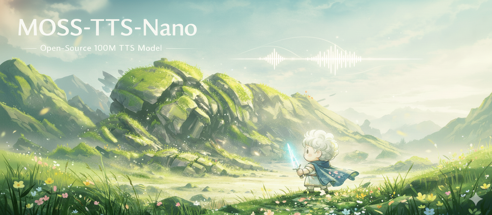
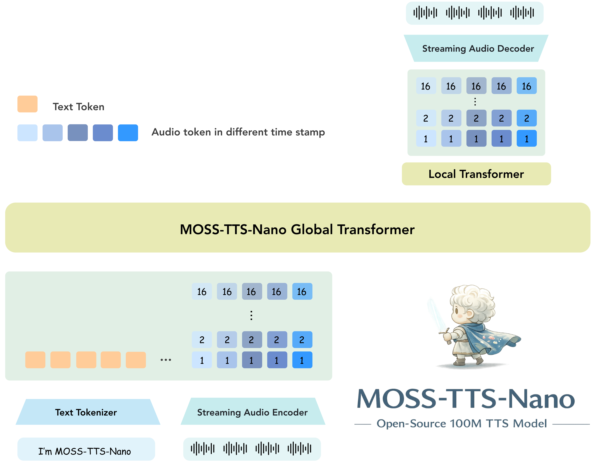
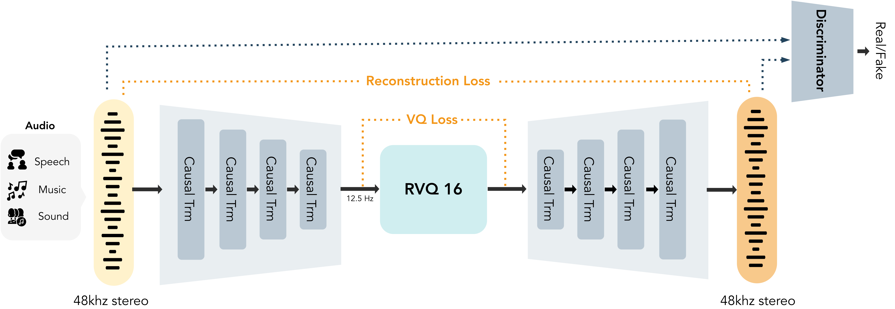
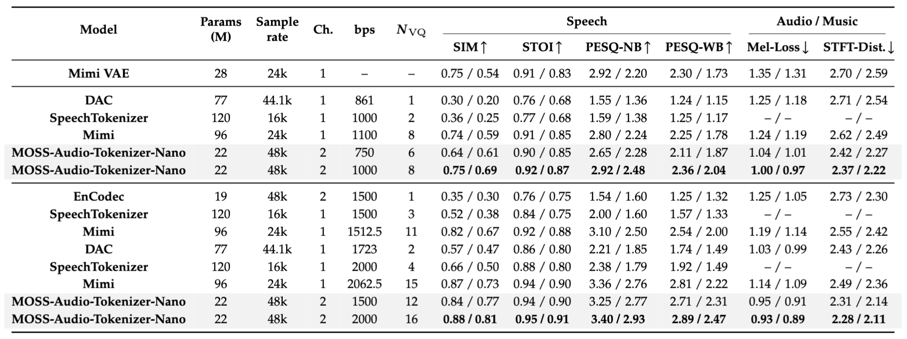
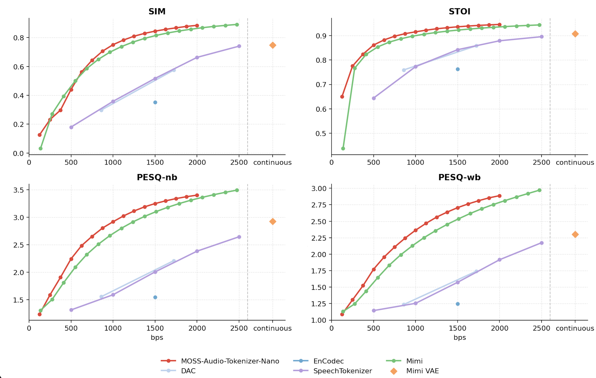
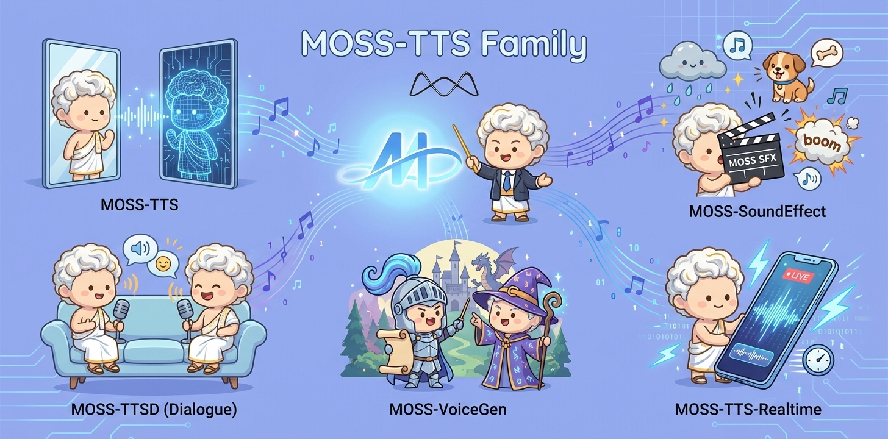

# MOSS-TTS-Nano

<br>

<p align="center">
  
  &nbsp;&nbsp;&nbsp;&nbsp;
  
</p>

<div align="center">
  <a href="https://clawhub.ai/luogao2333/moss-tts-voice"></a>
  <a href="https://huggingface.co/OpenMOSS-Team/MOSS-TTS-Nano"></a>
  <a href="https://modelscope.cn/collections/OpenMOSS-Team/MOSS-TTS-Nano"></a>
  <a href="https://openmoss.github.io/MOSS-TTS-Nano-Demo/"></a>
  <a href="https://arxiv.org/abs/2603.18090"></a>
  <a href="https://studio.mosi.cn/experiments/moss-tts-nano"></a>
  <a href="https://studio.mosi.cn/docs/moss-tts-nano"></a>
  <a href="https://x.com/Open_MOSS"></a>
  <a href="https://discord.gg/Xf3aXddCjc"></a>
  <a href="./assets/images/wechat.jpg"></a>
</div>

[English](README.md) | [简体中文](README_zh.md)

MOSS-TTS-Nano 是来自 [MOSI.AI](https://mosi.cn/#hero) 和 [OpenMOSS 团队](https://www.open-moss.com/) 的开源**多语言微型语音生成模型**。仅包含 **0.1B 参数**，专为**实时语音生成**设计，可直接在 **CPU 上运行（无需 GPU）**，并保持部署栈足够简单，适用于本地演示、网络服务和轻量级产品集成。

## MOSS-TTS 2.0 需求收集

[demo_video.mp4](https://github.com/user-attachments/assets/25aca215-0bd7-4d0c-be95-8d1f6737aec8)

## 新闻

* 2026.5.6：**MOSS-TTS**、**MOSS-TTS-Nano** 和 **MOSS-Audio-Tokenizer** 现已支持 [**mlx-audio**](https://github.com/Blaizzy/mlx-audio)，详情请访问 [mlx-audio GitHub 仓库](https://github.com/Blaizzy/mlx-audio)。
* 2026.4.29：MOSS-TTS 2.0 即将到来！我们正在通过[需求收集表](https://acnc6zeentra.feishu.cn/share/base/form/shrcnyAe1LwqKWjCSuW4wiZ2Hef)收集大家在使用 TTS 过程中的反馈、建议与功能需求。
* 2026.4.27：我们新增了 [**MOSS-Audio-Tokenizer-Nano**](#moss-audio-tokenizer-nano) 的最新评测结果，包括在语音、音频和音乐基准上的重建质量对比。
* 2026.4.17：我们很高兴发布更加高效且可独立运行的 [**ONNX CPU 版本**](#onnx-cpu-version)，对应 Hugging Face 仓库 [**MOSS-TTS-Nano-100M-ONNX**](https://huggingface.co/OpenMOSS-Team/MOSS-TTS-Nano-100M-ONNX) 与 [**MOSS-Audio-Tokenizer-Nano-ONNX**](https://huggingface.co/OpenMOSS-Team/MOSS-Audio-Tokenizer-Nano-ONNX)。该版本在推理阶段不再依赖 PyTorch，完整保留音色克隆工作流；根据我们的实测，其处理效率较原版接近翻倍，并且在 **MacBook Air M4** 上仅使用 **1 核 CPU** 即可流畅运行。基于这一 ONNX CPU 版本，我们也同步更新了 [**MOSS-TTS-Nano-Reader**](https://github.com/OpenMOSS/MOSS-TTS-Nano-Reader)，现在可以直接以浏览器插件的形式在浏览器内运行本模型，无需再在本地单独部署推理服务。
* 2026.4.16：我们发布了 **MOSS-TTS-Nano 微调代码**。训练和使用说明见 [./finetuning/README_zh.md](./finetuning/README_zh.md)。
* 2026.4.14：我们发布了 [**MOSS-TTS-Nano-Reader**](https://github.com/OpenMOSS/MOSS-TTS-Nano-Reader)，这是一个基于 **MOSS-TTS-Nano** 的本地浏览器网页朗读应用。
* 2026.4.10：我们发布了 **MOSS-TTS-Nano**。演示 Space 已在 [OpenMOSS-Team/MOSS-TTS-Nano](https://huggingface.co/spaces/OpenMOSS-Team/MOSS-TTS-Nano) 上线，也可以通过 [openmoss.github.io/MOSS-TTS-Nano-Demo/](https://openmoss.github.io/MOSS-TTS-Nano-Demo/) 查看 demo 和更多细节。

## 演示

- 在线演示：[https://openmoss.github.io/MOSS-TTS-Nano-Demo/](https://openmoss.github.io/MOSS-TTS-Nano-Demo/)
- Hugging Face Space：[OpenMOSS-Team/MOSS-TTS-Nano](https://huggingface.co/spaces/OpenMOSS-Team/MOSS-TTS-Nano)

## 目录

- [MOSS-TTS-Nano](#moss-tts-nano)
  - [MOSS-TTS 2.0 需求收集](#moss-tts-20-需求收集)
  - [新闻](#新闻)
  - [演示](#演示)
  - [目录](#目录)
  - [介绍](#介绍)
    - [主要特性](#主要特性)
  - [支持的语言](#支持的语言)
  - [快速开始](#快速开始)
    - [环境配置](#环境配置)
      - [使用 Conda](#使用-conda)
    - [使用 `infer.py` 进行语音克隆](#使用-inferpy-进行语音克隆)
    - [使用 `app.py` 启动本地 Web 演示](#使用-apppy-启动本地-web-演示)
  - [ONNX CPU 版本](#onnx-cpu-版本)
    - [Android ONNX Runtime 示例](#android-onnx-runtime-示例)
    - [导出仅 TTS 的 ONNX 权重](#导出仅-tts-的-onnx-权重)
    - [CLI 命令：`moss-tts-nano generate`](#cli-命令moss-tts-nano-generate)
    - [CLI 命令：`moss-tts-nano serve`](#cli-命令moss-tts-nano-serve)
    - [微调](#微调)
  - [MOSS-Audio-Tokenizer-Nano](#moss-audio-tokenizer-nano)
    - [介绍](#介绍-1)
    - [模型权重](#模型权重)
    - [评测指标](#评测指标)
    - [LibriSpeech 语音指标（MOSS-Audio-Tokenizer-Nano vs. 开源 Tokenizer）](#librispeech-语音指标moss-audio-tokenizer-nano-vs-开源-tokenizer)
  - [MOSS-TTS 家族](#moss-tts-家族)
    - [介绍](#介绍-2)
    - [已发布模型](#已发布模型)
  - [许可证](#许可证)
  - [引用](#引用)
  - [Star 历史](#star-历史)

## 介绍

<p align="center">
  
</p>

MOSS-TTS-Nano 专注于 TTS 部署中最重要的部分：**小体积**、**低延迟**、**足够好的实时产品质量** 和 **简单的本地配置**。它使用纯自回归 **Audio Tokenizer + LLM** 管道，并保持推理工作流对终端用户和网络演示用户都友好。

### 主要特性

- **超小模型尺寸**：仅 **0.1B 参数**
- **原生音频格式**：**48 kHz**、**2 声道**输出
- **多语言支持**：支持 **中文、英文等多种语言**
- **纯自回归架构**：基于 **Audio Tokenizer + LLM**
- **流式推理**：低实时延迟和快速首字节音频
- **CPU 友好**：流式生成可在 **4 核 CPU** 上运行
- **长文本支持**：支持长输入，具有自动分块语音克隆
- **开源部署**：支持直接 `python infer.py`、`python app.py` 和打包 CLI

<p align="center">
  
  <br />
  MOSS-TTS-Nano 架构图
</p>

## 支持的语言

MOSS-TTS-Nano 目前支持 **20 种语言**：

| 语言 | 代码 | 旗帜 | 语言 | 代码 | 旗帜 | 语言 | 代码 | 旗帜 |
|---|---|---|---|---|---|---|---|---|
| 中文 | zh | 🇨🇳 | 英文 | en | 🇺🇸 | 德语 | de | 🇩🇪 |
| 西班牙语 | es | 🇪🇸 | 法语 | fr | 🇫🇷 | 日语 | ja | 🇯🇵 |
| 意大利语 | it | 🇮🇹 | 匈牙利语 | hu | 🇭🇺 | 韩语 | ko | 🇰🇷 |
| 俄语 | ru | 🇷🇺 | 波斯语 (Farsi) | fa | 🇮🇷 | 阿拉伯语 | ar | 🇸🇦 |
| 波兰语 | pl | 🇵🇱 | 葡萄牙语 | pt | 🇵🇹 | 捷克语 | cs | 🇨🇿 |
| 丹麦语 | da | 🇩🇰 | 瑞典语 | sv | 🇸🇪 | 希腊语 | el | 🇬🇷 |
| 土耳其语 | tr | 🇹🇷 |  |  |  |  |  |  |

## 快速开始

### 环境配置

我们建议先创建一个干净的 Python 环境，然后以可编辑模式安装项目，使得 `moss-tts-nano` 命令在本地可用。下面的示例故意保持参数最少，依赖仓库默认设置。默认情况下，代码加载 `OpenMOSS-Team/MOSS-TTS-Nano` 和 `OpenMOSS-Team/MOSS-Audio-Tokenizer-Nano`。

#### 使用 Conda

```bash
conda create -n moss-tts-nano python=3.12 -y
conda activate moss-tts-nano

git clone https://github.com/OpenMOSS/MOSS-TTS-Nano.git
cd MOSS-TTS-Nano

pip install -r requirements.txt
pip install -e .
```

如果 `WeTextProcessing` 或 `pynini` 无法从 `requirements.txt` 安装，请先在同一环境中安装 `pynini`，再安装 `WeTextProcessing`，然后从 `requirements.txt` 中移除 `WeTextProcessing`，最后重新执行 `pip install -r requirements.txt`。

推荐优先使用 Conda：

```bash
conda install -c conda-forge pynini=2.1.6.post1 -y
pip install git+https://github.com/WhizZest/WeTextProcessing.git
pip install -r requirements.txt
```

如果不使用 Conda，请先准备与当前 Python 版本和平台匹配的 `pynini` wheel，再安装 `WeTextProcessing`。可参考 [Issue #6](https://github.com/OpenMOSS/MOSS-TTS-Nano/issues/6) 中给出的安装示例。

### 使用 `infer.py` 进行语音克隆

本仓库保留了直接 Python 入口点用于本地推理。下面的示例使用 **语音克隆模式**，这是 MOSS-TTS-Nano 的主要推荐工作流。

```bash
python infer.py \
  --prompt-audio-path assets/audio/zh_1.wav \
  --text "欢迎关注模思智能、上海创智学院与复旦大学自然语言处理实验室。"
```

默认情况下，这会将音频写入 `generated_audio/infer_output.wav`。

### 使用 `app.py` 启动本地 Web 演示

您可以启动本地 FastAPI 演示进行基于浏览器的测试：

```bash
python app.py
```

然后在浏览器中打开 `http://127.0.0.1:18083`。

<a id="onnx-cpu-version"></a>

## ONNX CPU 版本

我们现在十分推荐优先尝试 **ONNX CPU 版本**，尤其适合轻量本地部署和纯 CPU 推理场景。

这一版本在保留 MOSS-TTS-Nano 核心体验的同时，更适合直接部署：

- **推理阶段不依赖 PyTorch**：直接基于 ONNX Runtime CPU 运行。
- **可独立运行、部署更轻量**：适合本地 demo、服务化和轻量集成。
- **完整保留语音克隆能力**：支持直接参考音频输入、内置音色和 `Realtime Streaming Decode`。
- **速度更快**：根据我们的实测，处理效率较原版**接近翻倍**。
- **单核可用性更强**：在 **MacBook Air M4** 上，仅使用 **1 核 CPU** 即可流畅运行。

对应的 ONNX 入口包括 `infer_onnx.py`、`app_onnx.py`，以及带 `--backend onnx` 的打包 CLI。

默认情况下，基于 ONNX Runtime CPU 运行，如果要切换到 GPU，需要安装 `onnxruntime-gpu`，然后可以通过 `--execution-provider cuda` 显式切到 CUDA。

如果要准备 CUDA ONNX Runtime 环境，请把 CPU 版 ONNX Runtime wheel 替换成 GPU 版：

```bash
pip uninstall -y onnxruntime
pip install "onnxruntime-gpu>=1.20.0"
```

如果不传 `--model-dir`，程序会默认检查 `./models`。当该目录下缺少模型时，会在首次运行时自动从下面两个 Hugging Face 仓库下载：

- [OpenMOSS-Team/MOSS-TTS-Nano-100M-ONNX](https://huggingface.co/OpenMOSS-Team/MOSS-TTS-Nano-100M-ONNX)
- [OpenMOSS-Team/MOSS-Audio-Tokenizer-Nano-ONNX](https://huggingface.co/OpenMOSS-Team/MOSS-Audio-Tokenizer-Nano-ONNX)

默认下载后的目录结构为：

- `models/MOSS-TTS-Nano-100M-ONNX`
- `models/MOSS-Audio-Tokenizer-Nano-ONNX`

命令行示例：

```bash
python infer_onnx.py \
  --prompt-audio-path assets/audio/zh_1.wav \
  --text "欢迎使用 ONNX Runtime CPU 版本。"
```

如果你已经有本地导出的 ONNX 目录，也可以显式传入：

```bash
python infer_onnx.py \
  --model-dir /path/to/models \
  --prompt-audio-path assets/audio/zh_1.wav \
  --text "欢迎使用 ONNX Runtime CPU 版本。"
```

如果要使用 CUDA 推理：

```bash
python infer_onnx.py \
  --execution-provider cuda \
  --prompt-audio-path assets/audio/zh_1.wav \
  --text "欢迎使用 ONNX Runtime CUDA 版本。"
```

CUDA 推理需要安装 `onnxruntime-gpu`。

本地 Web Demo：

```bash
python app_onnx.py
```

如果要用 CUDA 启动 ONNX Web Demo：

```bash
python app_onnx.py \
  --execution-provider cuda
```

然后在浏览器中打开 `http://127.0.0.1:18083`。

首次启动如果本地没有 ONNX 权重，会先自动下载。

### Android ONNX Runtime 示例

Android ONNX Runtime smoke 示例位于 [`examples/android_onnx_runtime`](./examples/android_onnx_runtime)。

该示例会在 Android 设备端加载导出的 MOSS-TTS-Nano ONNX 图和 MOSS-Audio-Tokenizer-Nano ONNX 解码器，合成短的预分词 demo prompt，并写出 WAV 文件。示例刻意保持最小化，并将模型文件保留在 APK 外部，便于本地测试。

### 导出仅 TTS 的 ONNX 权重

如果重新训练了 `MOSS-TTS-Nano`，那么需要重导 TTS 侧 ONNX 权重。[`onnx/`](./onnx) 目录下的导出脚本接收本地 Hugging Face 格式的 `MOSS-TTS-Nano` checkpoint，并输出一套仅包含 TTS 侧文件的 ONNX 模型目录。

示例：

```bash
python onnx/export_hf_to_tts_onnx.py \
  --checkpoint-path /path/to/MOSS-TTS-Nano \
  --output-dir /path/to/MOSS-TTS-Nano-100M-ONNX
```

输出目录包含：

- `moss_tts_prefill.onnx`
- `moss_tts_decode_step.onnx`
- `moss_tts_local_decoder.onnx`
- `moss_tts_local_cached_step.onnx`
- `moss_tts_local_fixed_sampled_frame.onnx`
- `moss_tts_global_shared.data`
- `moss_tts_local_shared.data`
- `tts_browser_onnx_meta.json`
- `tokenizer.model`

这个脚本面向 ONNX 部署链路。只要 `MOSS-Audio-Tokenizer-Nano` 没变，原先基于它生成的 prompt audio codes 不需要重新生成。

### CLI 命令：`moss-tts-nano generate`

安装后 `pip install -e .`，您可以直接调用打包的 CLI：

```bash
moss-tts-nano generate \
  --prompt-speech assets/audio/zh_1.wav \
  --text "欢迎关注模思智能、上海创智学院与复旦大学自然语言处理实验室。"
```

如果要切到 ONNX CPU 后端，只需加上 `--backend onnx`：

```bash
moss-tts-nano generate \
  --backend onnx \
  --prompt-speech assets/audio/zh_1.wav \
  --text "欢迎关注模思智能、上海创智学院与复旦大学自然语言处理实验室。"
```

ONNX 后端默认使用 CPU。如果要显式切到 CUDA：

```bash
moss-tts-nano generate \
  --backend onnx \
  --execution-provider cuda \
  --prompt-speech assets/audio/zh_1.wav \
  --text "欢迎关注模思智能、上海创智学院与复旦大学自然语言处理实验室。"
```

有用的提示：

- `moss-tts-nano generate` 默认写入 `generated_audio/moss_tts_nano_output.wav`。
- `--prompt-speech` 是用于语音克隆的参考音频路径的友好别名。
- 支持 `--text-file` 用于长文本合成。
- ONNX CUDA 推理需要安装 `onnxruntime-gpu`；不传 `--execution-provider cuda` 时，ONNX 推理仍然默认只使用 CPU。

### CLI 命令：`moss-tts-nano serve`

您也可以通过打包的 CLI 启动网络演示：

```bash
moss-tts-nano serve
```

如果要启动 ONNX Web Demo：

```bash
moss-tts-nano serve \
  --backend onnx
```

如果要用 CUDA 启动 ONNX Web Demo：

```bash
moss-tts-nano serve \
  --backend onnx \
  --execution-provider cuda
```

此命令会转发到对应的 Web App，将模型保持在内存中加载，并为本地浏览器演示和 HTTP 生成端点提供服务。

如需以分页 KV 缓存、流式推理以及 OpenAI 兼容 `/v1/audio/speech` 接口部署服务，请参考 [vLLM-Omni MOSS-TTS-Nano README](https://github.com/vllm-project/vllm-omni/blob/main/examples/online_serving/moss_tts_nano/README.md)。

### 微调

微调教程已经提供。

具体见 [./finetuning/README_zh.md](./finetuning/README_zh.md)。

## MOSS-Audio-Tokenizer-Nano

<a id="mat-intro"></a>
### 介绍

**MOSS-Audio-Tokenizer** 是整个 MOSS-TTS 系列的统一离散音频接口。它基于 **Cat**（**C**ausal **A**udio **T**okenizer with **T**ransformer）架构构建，这是一个由因果 Transformer 块完全组成的无 CNN 音频分词器。它作为 MOSS-TTS、MOSS-TTS-Nano、MOSS-TTSD、MOSS-VoiceGenerator、MOSS-SoundEffect 和 MOSS-TTS-Realtime 的共享音频 tokenizer，为整个产品系列提供一致的音频表示。

为了进一步提高感知质量同时降低推理成本，我们训练了 **MOSS-Audio-Tokenizer-Nano**，这是一个轻量级分词器，包含约 **20M 参数**，专为高保真音频压缩设计。它支持 **48 kHz** 输入输出以及 **立体声音频**，有助于减少压缩损失并提高听觉质量。它可以将 **48 kHz 立体声音频**压缩成 **12.5 Hz** 的 token 流，使用 **16 个码本的 RVQ**，在 **0.125 kbps 到 2 kbps** 的可变码率范围内实现高保真重建。

要了解更多关于设置、高级用法和评估指标的信息，请访问 [MOSS-Audio-Tokenizer 仓库](https://github.com/OpenMOSS/MOSS-Audio-Tokenizer)。

<p align="center">
  
  MOSS-Audio-Tokenizer-Nano 架构
</p>

### 模型权重

| 模型 | Hugging Face | ModelScope |
|:-----:|:------------:|:----------:|
| **MOSS-Audio-Tokenizer-Nano** | [](https://huggingface.co/OpenMOSS-Team/MOSS-Audio-Tokenizer-Nano) | [](https://modelscope.cn/models/openmoss/MOSS-Audio-Tokenizer-Nano) |

### 评测指标

下表将 **MOSS-Audio-Tokenizer-Nano** 与参数量 **不超过 120M** 的开源音频 tokenizer 进行对比，评估其在语音、音频和音乐数据上的重建质量。可以看到，MOSS-Audio-Tokenizer-Nano 在模型规模接近最小的同时，取得了最好的整体重建质量。

- 语音指标在 LibriSpeech test-clean（英文）和 AISHELL-2（中文）上评测，结果以 EN/ZH 的形式报告。
- 音频指标在 AudioSet evaluation subset 上评测，音乐指标在 MUSDB 上评测，结果以 audio/music 的形式报告。
- STFT-Dist. 表示 STFT 距离。
- 语音指标越高越好；音频和音乐指标中，Mel-Loss 与 STFT-Dist. 越低越好。
- Ch. 表示 audio tokenizer 支持的输入/输出声道数：`ch=1` 表示单声道音频，`ch=2` 表示立体声音频。
- Nvq 表示量化器数量。

<br>
<p align="center">
     <br>
    开源音频 tokenizer 在语音、音频和音乐数据上的重建质量对比。
</p>
<br>

### LibriSpeech 语音指标（MOSS-Audio-Tokenizer-Nano vs. 开源 Tokenizer）

下图将 **MOSS-Audio-Tokenizer-Nano** 与参数量 **不超过 120M** 的开源音频 tokenizer 和 codec 在 LibriSpeech 数据集上进行对比。评测指标包括 SIM、STOI、PESQ-NB 和 PESQ-WB，数值越高表示重建质量越好。
对于同一个模型，我们通过调整推理时使用的 RVQ 码本数量来控制码率。

<br>
<p align="center">
     <br>
    不同码率下的 LibriSpeech 重建质量对比。
</p>
<br>

<a id="moss-tts"></a>
## MOSS-TTS 家族

### 介绍

<p align="center">
  
</p>

**MOSS-TTS 家族**是 OpenMOSS 开源的语音与声音生成模型系列，面向自然语音、高表现力表达、长文本稳定生成、多说话人交互、音色设计、音效生成以及实时语音响应等任务。

这个系列目前包含以下模型：

- **MOSS-TTS**：家族中的旗舰模型，支持 **高保真零样本语音克隆**、**长文本长语音生成**、**拼音 / 音素 / 时长细粒度控制**，以及 **多语种 / 中英混合合成**。
- **MOSS-TTS-Local-Transformer**：基于 `MossTTSLocal` 的较小参数模型，用更轻量的规模延续 MOSS-TTS 家族的语音生成能力。
- **MOSS-TTSD-v1.0**：面向 **高表现力**、**多说话人**、**超长对话** 场景的有声对话生成模型。
- **MOSS-VoiceGenerator**：音色设计模型，可直接根据**文本提示**生成多样的音色与说话风格，不需要参考音频。
- **MOSS-SoundEffect**：可控音效生成模型，支持自然环境、城市场景、生物、人类动作和短音乐化片段等声音生成。
- **MOSS-TTS-Realtime**：面向低延迟语音智能体的实时语音模型，强调多轮回复中的自然性、连贯性和音色一致性。


### 已发布模型

| 模型 | 架构 | 参数规模 | Hugging Face | ModelScope |
|---|---|---:|---|---|
| **MOSS-TTS** | `MossTTSDelay` | 8B | [](https://huggingface.co/OpenMOSS-Team/MOSS-TTS) | [](https://modelscope.cn/models/openmoss/MOSS-TTS) |
| **MOSS-TTS-Local-Transformer** | `MossTTSLocal` | 1.7B | [](https://huggingface.co/OpenMOSS-Team/MOSS-TTS-Local-Transformer) | [](https://modelscope.cn/models/openmoss/MOSS-TTS-Local-Transformer) |
| **MOSS-TTSD-v1.0** | `MossTTSDelay` | 8B | [](https://huggingface.co/OpenMOSS-Team/MOSS-TTSD-v1.0) | [](https://modelscope.cn/models/openmoss/MOSS-TTSD-v1.0) |
| **MOSS-VoiceGenerator** | `MossTTSDelay` | 1.7B | [](https://huggingface.co/OpenMOSS-Team/MOSS-VoiceGenerator) | [](https://modelscope.cn/models/openmoss/MOSS-VoiceGenerator) |
| **MOSS-SoundEffect** | `MossTTSDelay` | 8B | [](https://huggingface.co/OpenMOSS-Team/MOSS-SoundEffect) | [](https://modelscope.cn/models/openmoss/MOSS-SoundEffect) |
| **MOSS-TTS-Realtime** | `MossTTSRealtime` | 1.7B | [](https://huggingface.co/OpenMOSS-Team/MOSS-TTS-Realtime) | [](https://modelscope.cn/models/openmoss/MOSS-TTS-Realtime) |

## 许可证

本仓库将遵循根目录中的 `LICENSE` 文件中指定的许可证。如果您在该文件发布前阅读本文档，请将本仓库视为 **未获得重新发布许可**。

## 引用

如果您在研究或产品中使用了 MOSS-TTS-Nano 工作，请引用：

```bibtex
@misc{openmoss2026mossttsnano,
  title={MOSS-TTS-Nano},
  author={OpenMOSS Team},
  year={2026},
  howpublished={GitHub repository},
  url={https://github.com/OpenMOSS/MOSS-TTS-Nano}
}
```

```bibtex
@misc{gong2026mossttstechnicalreport,
  title={MOSS-TTS Technical Report},
  author={Yitian Gong and Botian Jiang and Yiwei Zhao and Yucheng Yuan and Kuangwei Chen and Yaozhou Jiang and Cheng Chang and Dong Hong and Mingshu Chen and Ruixiao Li and Yiyang Zhang and Yang Gao and Hanfu Chen and Ke Chen and Songlin Wang and Xiaogui Yang and Yuqian Zhang and Kexin Huang and ZhengYuan Lin and Kang Yu and Ziqi Chen and Jin Wang and Zhaoye Fei and Qinyuan Cheng and Shimin Li and Xipeng Qiu},
  year={2026},
  eprint={2603.18090},
  archivePrefix={arXiv},
  primaryClass={cs.SD},
  url={https://arxiv.org/abs/2603.18090}
}
```

```bibtex
@misc{gong2026mossaudiotokenizerscalingaudiotokenizers,
  title={MOSS-Audio-Tokenizer: Scaling Audio Tokenizers for Future Audio Foundation Models},
  author={Yitian Gong and Kuangwei Chen and Zhaoye Fei and Xiaogui Yang and Ke Chen and Yang Wang and Kexin Huang and Mingshu Chen and Ruixiao Li and Qingyuan Cheng and Shimin Li and Xipeng Qiu},
  year={2026},
  eprint={2602.10934},
  archivePrefix={arXiv},
  primaryClass={cs.SD},
  url={https://arxiv.org/abs/2602.10934}
}
```

## Star 历史

[](https://star-history.com/#OpenMOSS/MOSS-TTS-Nano&Date)
